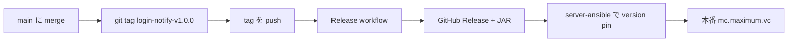

# リリース

## 概要



mc-plugins 側の責務は **タグ付けと GitHub Release まで**。本番サーバーへの配置は server-ansible が行う。

## 1. main をリリース可能な状態にする

```bash
mise run test
```

PR 経由で main に merge 済みであること。CI が green であることを確認。

## 2. タグを付けて push

**形式:** `{plugin-dir}-v{semver}`

| 部分 | 例 | 説明 |
| --- | --- | --- |
| `plugin-dir` | `login-notify` | subproject ディレクトリ名（kebab-case） |
| semver | `1.0.0` | [Semantic Versioning 2.0.0](https://semver.org/) |

```bash
git checkout main
git pull
git tag login-notify-v1.0.0
git push origin login-notify-v1.0.0
```

### semver の目安

| 桁 | 例 | タイミング |
| --- | --- | --- |
| MAJOR | `2.0.0` | Paper / API 非互換、破壊的 config 変更 |
| MINOR | `1.1.0` | 後方互換の機能追加 |
| PATCH | `1.0.1` | バグ修正 |

## 3. GitHub Release を確認

`.github/workflows/release.yml` が tag push をトリガーに:

1. タグから plugin 名と version を parse
2. `./gradlew :{plugin}:bukkit:jar` でビルド
3. `{plugin}/bukkit/build/libs/*.jar` を Release asset として upload

Release ページに `MaximumLoginNotify.jar`（等）が添付されていることを確認。

## 4. 本番反映（server-ansible）

mc-plugins だけでは本番は更新されない。**server-ansible 側で release tag を pin し、ansible-playbook を実行**する。

詳細: [production-deploy.md](./production-deploy.md)

### ざっくり流れ

1. prod group vars の `mc_plugins.login-notify.release_tag`（等）を新 tag に更新
2. PR → merge → CD が JAR を取得して `/minecraft/plugins/` に配置
3. 必要に応じて Paper コンテナを再起動

## トラブルシュート

| 症状 | 確認 |
| --- | --- |
| Release workflow が動かない | tag が `*-v*.*.*` 形式か（例: `login-notify-v1.0.0`） |
| Gradle project not found | tag の prefix が `settings.gradle.kts` の `include(...)` と一致するか |
| 本番に JAR が届かない | server-ansible の tag pin と CD ログを確認（mc-plugins Release は成功しているか） |
