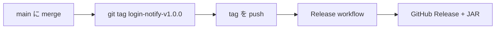

# リリース

## 概要



タグ push で GitHub Actions が JAR をビルドし、Release asset として公開する。

## 1. main をリリース可能な状態にする

```bash
mise run test
```

PR 経由で main に merge 済みであること。CI が green であることを確認。

**feature branch から tag を push しない。** Release workflow は tag の commit が `origin/main` 上にあることを検証する。main 未 merge の tag は Release されない。

## 2. タグを付けて push

**必ず `main` の最新 commit に tag を付ける。**

**形式:** `{plugin-dir}-v{semver}`

| 部分 | 例 | 説明 |
| --- | --- | --- |
| `plugin-dir` | `login-notify` | subproject ディレクトリ名（kebab-case） |
| semver | `1.0.0` | [Semantic Versioning 2.0.0](https://semver.org/) |

```bash
git checkout main
git pull
git tag login-notify-v1.0.0
git push origin login-notify-v1.0.0
```

### semver の目安

| 桁 | 例 | タイミング |
| --- | --- | --- |
| MAJOR | `2.0.0` | Paper / API 非互換、破壊的 config 変更 |
| MINOR | `1.1.0` | 後方互換の機能追加 |
| PATCH | `1.0.1` | バグ修正 |

## 3. GitHub Release を確認

`.github/workflows/release.yml` が tag push をトリガーに:

1. タグから plugin 名と version を parse
2. `./gradlew :{plugin}:bukkit:jar` でビルド
3. `{plugin}/bukkit/build/libs/*.jar` を Release asset として upload

Release ページに `MaximumLoginNotify.jar`（等）が添付されていることを確認。

### asset URL

```
https://github.com/saitamau-maximum/mc-plugins/releases/download/{release_tag}/{jar_name}
```

## 4. サーバーへの配置（参考）

1. Release から JAR をダウンロード
2. Paper サーバーの `plugins/` に配置
3. 初回起動後、`plugins/MaximumLoginNotify/config.yml` を編集（`discord.webhook-url` 等）

secret は repo に含めない。`config.yml` はサーバー側で設定する。

## トラブルシュート

| 症状 | 確認 |
| --- | --- |
| Release workflow が `Release tag must point to a commit on origin/main` で失敗 | tag を feature branch から push していないか。`git checkout main && git pull` 後に tag を付け直す |
| Release workflow が動かない | tag が `*-v*.*.*` 形式か（例: `login-notify-v1.0.0`） |
| Gradle project not found | tag の prefix が `settings.gradle.kts` の `include(...)` と一致するか |
| Release に JAR がない | workflow ログと asset 名 |
